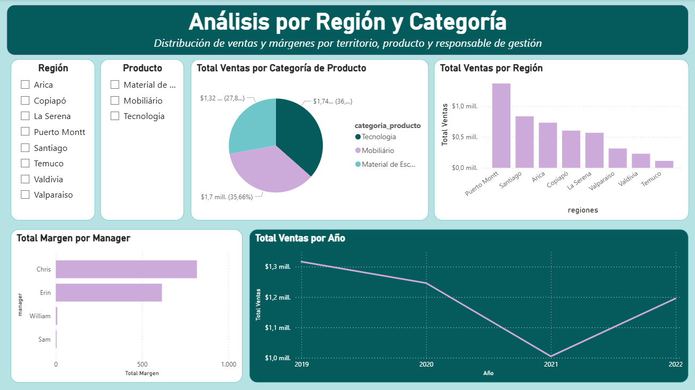
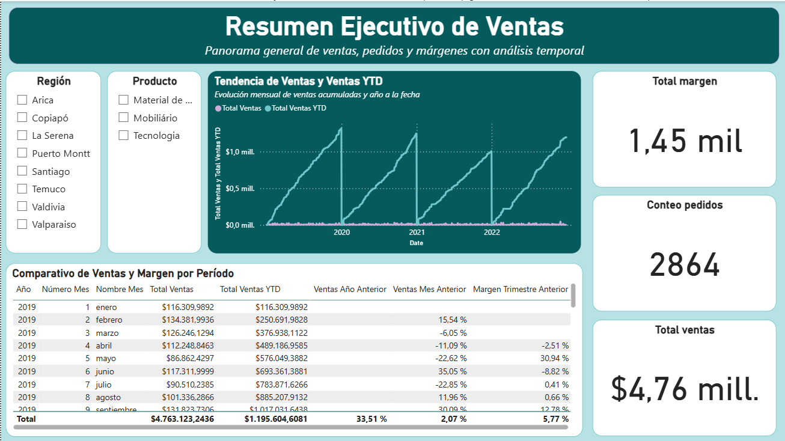
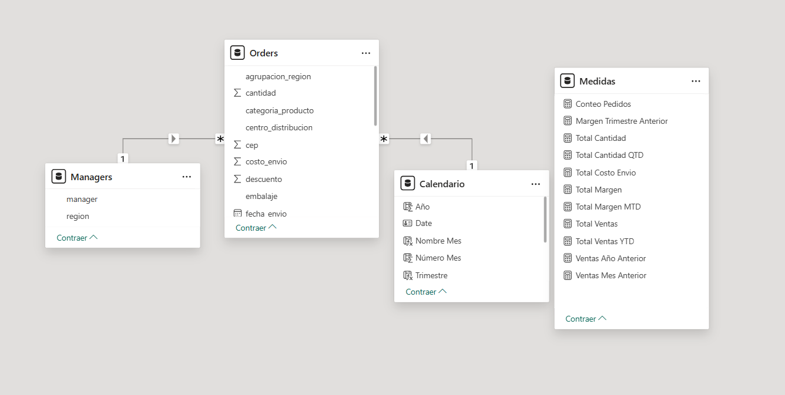
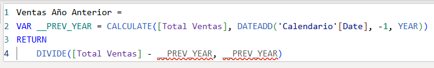
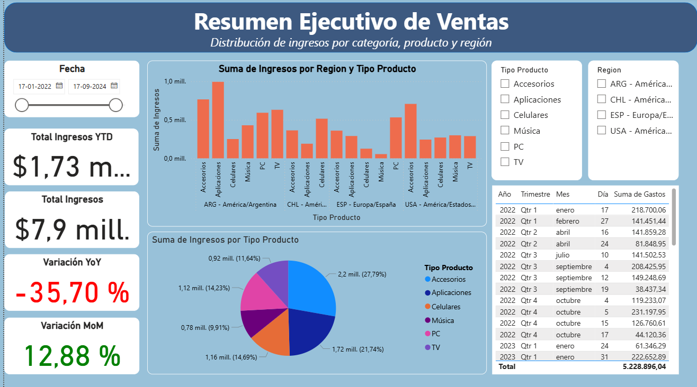
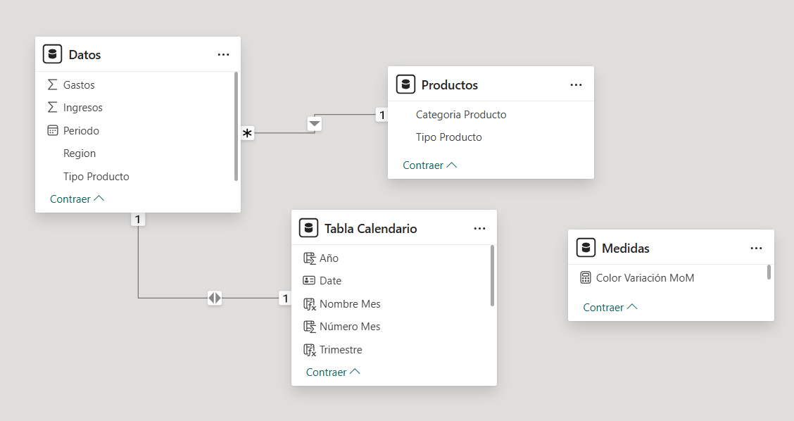

# Power BI - Data Analytics Portfolio

## 🇬🇧 **English**

This repository contains a collection of data analytics exercises and projects developed in Power BI, integrating SQL for data extraction, transformation and analysis.

It includes both personal projects and academic/training exercises, used as practical evidence of my skills in Business Intelligence, data visualization, and insight generation for decision-making. 

**What yo will find in this repository**
- Interactive dashboards built in Power BI
- SQL used for querying, cleaning, and preparing data
- Data modeling and table relationships
- DAX measures and calculations
- Exploratory and visual data analysis
- Key Performance Indicators (KPIs) focused on business use cases

**Tools and technologies**
- Power BI Desktop
- SQL
- DAX
- Excel/CSV

## 🇪🇸 **Español**

Este repositorio contiene una colección de proyectos y ejercicios de análisis de datos desarrollados en Power BI, integrando SQL para la extracción, transformación y análisis de datos. 

Incluye tanto proyectos personales como ejercicios académicos y de formación, utilizados para mostrar mis habilidades en Business Intelligence, visualización de datos y generación de insights para la toma de decisiones. 

**Que encontrarás en este repositorio**
- Dashboards interactivos desarrollados en Power BI
- Uso de SQL para consulta, limpieza y preparación de datos
- Modelado de datos y relaciones
- Medidas y cálculos con DAX
- Análisis exploratorio y visual
- Indicadores clave (KPIs) orientados a casos de negocio

**Herramientas y tecnologías**
- Power BI Desktop
- SQL
- DAX
- Excel/CSV

# Projects and Screenshots
## Sales Performance & Time Intelligence Dashboard (Power BI)

## Revenue Analysis by Region & Product (Power BI)

